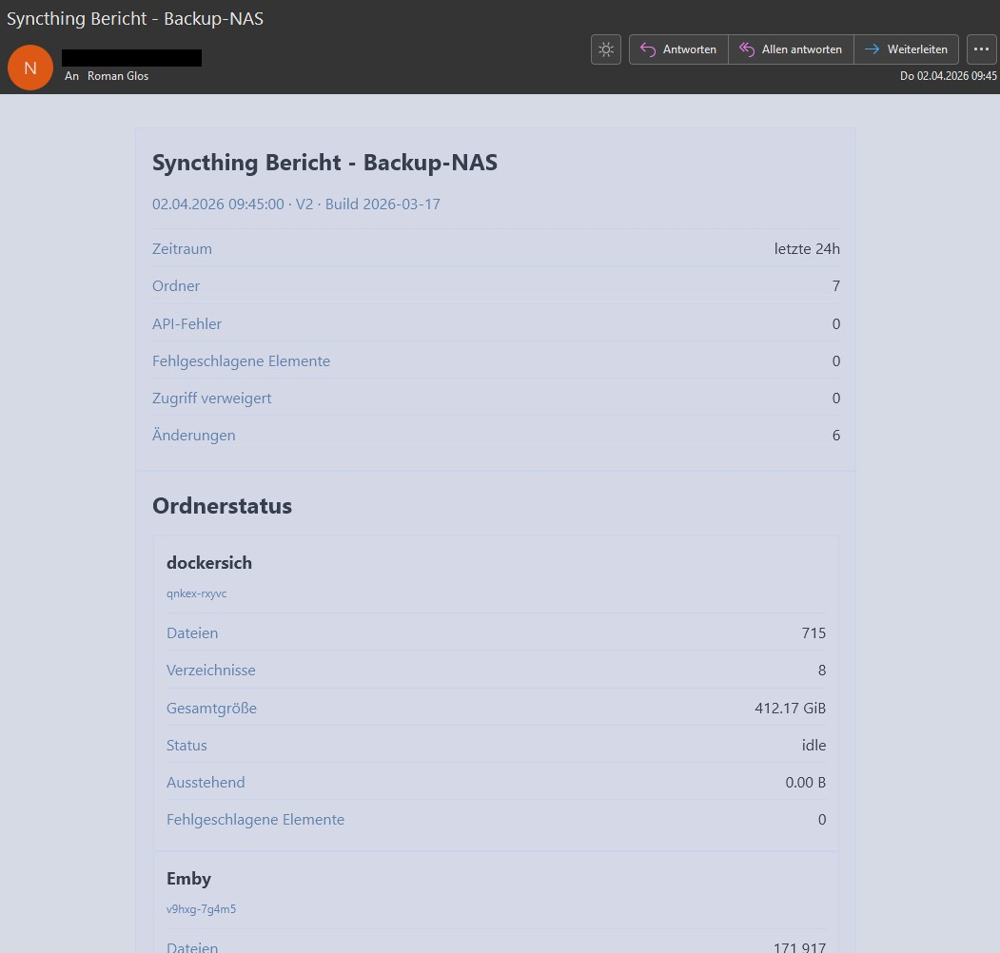
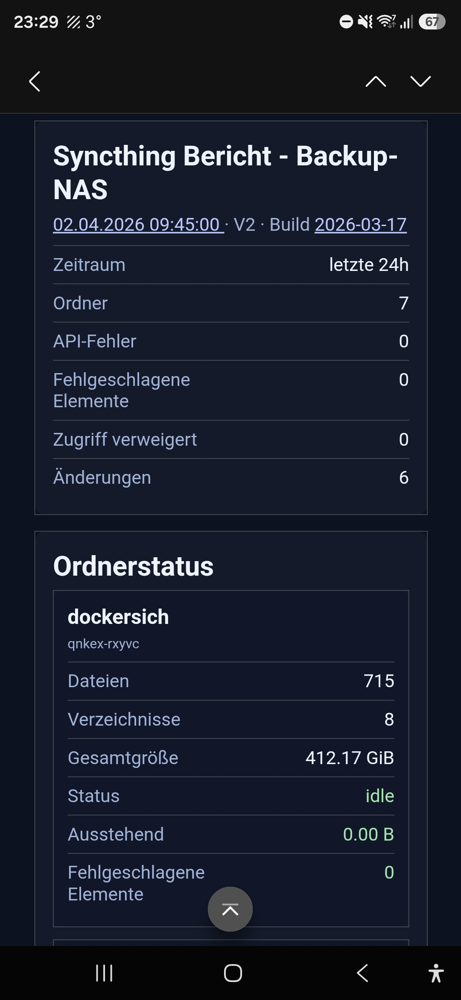

# UGREEN Syncthing Reporter

Der UGREEN Syncthing Reporter ist ein leichtgewichtiges Docker-Paket für Syncthing, das einen täglichen HTML-Bericht per E-Mail oder über Apprise versenden kann.

Das Paket unterstützt Deutsch und Englisch in einem Projekt und ist besonders für UGREEN NAS mit UGOS geeignet, funktioniert aber grundsätzlich auch auf anderen Docker-Hosts.

## Features

- Täglicher HTML-Bericht für Syncthing
- Versand per E-Mail oder Apprise
- Deutsch und Englisch über `REPORT_LANG=de` oder `REPORT_LANG=en`
- Ãœbersicht zu Ordnerstatus, API-Fehlern und fehlgeschlagenen Elementen
- Auswertung der Änderungen der letzten X Stunden über `WINDOW_HOURS`
- Outlook-freundliches HTML-Layout
- Docker-Setup mit separatem Reporter-Container

## Screenshots

### Desktop-Ansicht

<p align="center">
  
</p>

### Mobile Ansicht

<p align="center">
  
</p>

## Projektstruktur

```text
UGREEN-Syncthing-Reporter/
├─ README.md
├─ LICENSE
├─ .gitignore
├─ UGREEN_Syncthing_Reporter_Handbuch_DE-EN.pdf
├─ Screens/
│  ├─ DE_Mail.jpg
│  └─ DE_MailMobil.jpg
└─ syncthing/
   ├─ .env.example
   ├─ docker-compose.yaml
   ├─ syncthing/
   │  └─ config/
   │     └─ PLACEHOLDER.txt
   └─ syncthing_reporter_py/
      ├─ Dockerfile
      ├─ entry.sh
      ├─ report.py
      ├─ requirements.txt
      └─ scheduler.sh
```

## Quickstart

1. Kopiere das Paket auf dein NAS oder deinen Docker-Host.
2. Kopiere `syncthing/.env.example` nach `syncthing/.env`.
3. Passe die Werte in `.env` an deine Umgebung an.
4. Ergänze bei Bedarf eigene Syncthing-Datenpfade in `docker-compose.yaml`.
5. Starte den Stack:

```bash
cd syncthing
docker compose up -d --build
```

## Lizenz und Nutzung

Dieses Projekt steht unter der **PolyForm Noncommercial License 1.0.0**.

- Nichtkommerzielle Nutzung ist erlaubt
- Kommerzielle Nutzung ist nicht erlaubt
- Für kommerzielle Nutzung ist vorab eine schriftliche Genehmigung des Autors erforderlich

Bei Interesse an einer kommerziellen Nutzung kontaktiere mich bitte vorab.

## Wichtige Hinweise

- Kopiere vor dem Start `syncthing/.env.example` nach `syncthing/.env` und passe die Konfiguration an
- Bitte veröffentliche keine echten Zugangsdaten oder produktiven `.env` Dateien
- Während des Betriebs erzeugt der Reporter lokale Status- und Arbeitsdateien. Diese sind nur für den laufenden Betrieb gedacht und gehören nicht ins Repository
- Die Compose-Datei verwendet aktuell `syncthing/syncthing:latest`. Wer lieber mit festen Versionen arbeitet, kann das Image später auf einen bestimmten Tag umstellen

## Dokumentation

- Das ausführliche Handbuch liegt als PDF im Repository: `UGREEN_Syncthing_Reporter_Handbuch_DE-EN.pdf`

## Version

- Reporter-Version: V2.0
- Build-Stand im Paket: 2026-03-17.1

## English note

This project is licensed under the **PolyForm Noncommercial License 1.0.0**.

- Noncommercial use is allowed
- Commercial use is not allowed
- Commercial use requires prior written permission from the author

This repository contains a bilingual German and English Syncthing reporting package for Docker.
The main manual is included as a PDF in the repository, and the runtime language can be switched with `REPORT_LANG=de` or `REPORT_LANG=en`.
